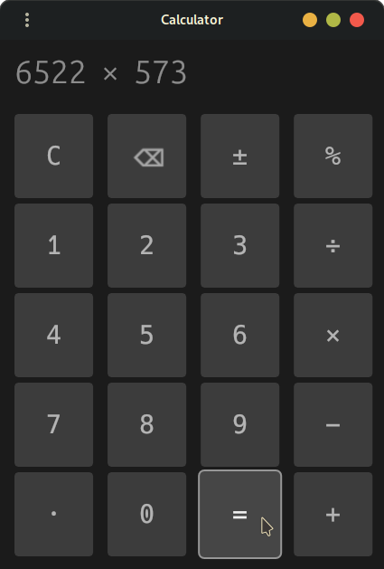

# calculator

Supports addition, subtraction, multiplication and division.

Clicking the buttons will evaluate the current input before changing mode.

For example, if the current input is `1000 + 3000` and you click the subtraction button, it will display `4000 - ____`

